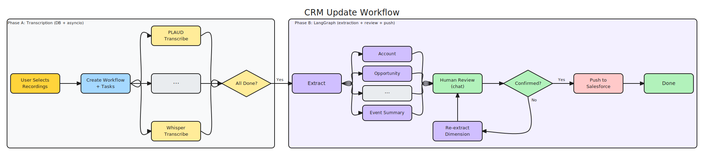

# CRM Update Workflow — 执行计划

## 架构概览



```
┌──────────────────────────────────────┐     ┌──────────────────────────────────────┐
│       Phase A: 转写 Pipeline          │     │       Phase B: LangGraph              │
│       (DB + asyncio)                  │     │       (extraction + review + push)    │
│                                      │     │                                      │
│  workflow_tasks 表追踪每个录音状态     │     │  AsyncPostgresSaver → Supabase        │
│                                      │     │                                      │
│  ┌─ P1: PLAUD → webhook → done      │     │  extract ──→ review ──→ push_to_crm  │
│  ├─ P2: PLAUD → webhook → done      │ ──→ │              ↑    │                  │
│  ├─ L1: Whisper → await  → done     │     │              └────┘                  │
│  └─ L2: Whisper → await  → done     │     │         (human chat loop)            │
│                                      │     │                                      │
│  all done → 触发 Phase B             │     │  State: transcripts, extractions,    │
│                                      │     │         messages, original_values    │
└──────────────────────────────────────┘     └──────────────────────────────────────┘
          Supabase (Postgres)                    LangGraph checkpointer (同一个 Postgres)
```

---

## Phase A: 转写 Pipeline (DB + asyncio)

转写阶段是纯 I/O 任务调度，不涉及 LLM。每个录音对应一个 `workflow_task`，独立追踪状态。所有 task 完成后自动触发 Phase B。

### 数据模型

**workflows 表**

| 字段 | 类型 | 说明 |
|------|------|------|
| id | UUID | PK |
| event_id | UUID | FK → events |
| state | TEXT | created / transcribing / extracting / review / pushing / done / failed |
| extractions | JSONB | 最新快照 `{ opportunity: {status, data}, ... }` |
| original_values | JSONB | Salesforce 现有值（Old Value 列） |
| created_at | TIMESTAMPTZ | |
| updated_at | TIMESTAMPTZ | |

**workflow_tasks 表**

| 字段 | 类型 | 说明 |
|------|------|------|
| id | UUID | PK |
| workflow_id | UUID | FK → workflows |
| type | TEXT | plaud / local |
| recording_id | TEXT | plaud_file_id 或 recordings.id |
| state | TEXT | pending / transcribing / completed / failed |
| transcript | TEXT | 转写结果 |
| error | TEXT | 失败原因 |
| created_at | TIMESTAMPTZ | |
| updated_at | TIMESTAMPTZ | |

### 状态流转

```
创建 workflow (state=transcribing)
  ├─ 为每个录音创建 task (state=pending)
  ├─ 本地录音 → 调 Whisper API (await) → task.state = completed
  └─ PLAUD 录音 → 触发转写 API → task.state = transcribing → webhook 回调 → task.state = completed

每个 task 完成时:
  查询 pending/transcribing task 数量
  = 0 → workflow.state = extracting, 触发 Phase B
  > 0 → 继续等待
```

### API

| Method | Path | 说明 |
|--------|------|------|
| POST | `/api/workflows` | 创建 workflow + tasks，触发转写 |
| GET | `/api/workflows/{id}` | 获取状态 + 进度 |
| GET | `/api/workflows/{id}/stream` | SSE 推送进度 (3/5 transcribed) |

---

## Phase B: LangGraph (Extraction + Review + Push)

LLM 密集阶段，使用 LangGraph 管理状态和 human-in-the-loop。Checkpointer 使用 `AsyncPostgresSaver` 连接 Supabase Postgres。

### LangGraph State

```python
class CrmWorkflowState(TypedDict):
    workflow_id: str
    transcripts: dict           # { recording_id: text }
    extractions: dict           # { dimension: { status, data/error } }
    original_values: dict       # { dimension: { field: old_value } }
    messages: list              # Claude conversation history
    should_push: bool           # review 阶段用户确认后为 True
```

### Graph 节点

```
START → extract → review ←→ (human loop) → push_to_crm → END
```

**extract** — 并行调 Claude 提取多个维度，每个维度对应一个 skill：

| Skill | 说明 |
|-------|------|
| Account | 公司名、行业、年收入等 |
| Opportunity | 阶段、金额、close date、next steps |
| Contact | 联系人、邮箱、职位变更 |
| Event Summary | 会议摘要、关键讨论点 |
| ··· | 可扩展更多维度 |

每个 skill: system prompt + output schema + Claude API (structured output)。使用 `asyncio.gather()` 并行执行。结果存入 `workflow.extractions`，每个维度带独立 status：

```python
extractions = {
    "opportunity": { "status": "completed", "data": { "stage": "Negotiation", ... } },
    "contact":     { "status": "failed",    "error": "LLM timeout" },
    "account":     { "status": "completed", "data": { "name": "Acme Corp", ... } },
}
```

至少 1 个维度 completed → 进入 review。

**review** — `interrupt()` 暂停，等用户 chat 输入，调 Claude + tools 处理：

| Tool | 说明 |
|------|------|
| update_field(dimension, field, value) | 直接修改某个字段 |
| re_extract(dimension, instructions) | 重跑某维度提取（覆盖快照） |
| confirm_and_push() | 用户确认，进入 push |

用户对话示例：
- "opportunity 的 close date 应该是 4 月 15 号" → `update_field`
- "重新分析下 contact" → `re_extract`
- "没问题了，推送吧" → `confirm_and_push`

Chat history 记录在 `messages` 中，extractions 保持最新快照。

**push_to_crm** — 通过 Composio 写入 Salesforce。

### API

| Method | Path | 说明 |
|--------|------|------|
| POST | `/api/workflows/{id}/chat` | Review 对话 (resume LangGraph) |
| PUT | `/api/workflows/{id}/extractions` | Edit Mode 直接修改字段 |
| POST | `/api/workflows/{id}/confirm` | 确认推送到 CRM |

---

## 依赖

```
langgraph >= 0.2.0
langgraph-checkpoint-postgres
anthropic                       # Claude API (extraction + review)
openai                          # Whisper API (本地录音转写)
httpx                           # PLAUD API 调用
```

---

## 执行步骤

### Step 1: 数据库 Migration

- 创建 `workflows` 表
- 创建 `workflow_tasks` 表
- 文件: `backend/supabase/migrations/20260317000001_add_workflows.sql`

### Step 2: Workflow CRUD + 状态机

- 创建 `backend/services/workflow.py` — 状态机逻辑
  - `create_workflow(event_id, recording_ids)` → 创建 workflow + tasks
  - `on_task_completed(task_id, transcript)` → 更新 task，检查 all done
  - `get_workflow_status(workflow_id)` → 返回当前状态 + 进度
- 创建 `backend/routers/workflows.py` — API endpoints
  - `POST /api/workflows`
  - `GET /api/workflows/{id}`

### Step 3: 转写服务

- 创建 `backend/services/transcription.py`
  - `transcribe_local(recording_id)` → Whisper API 调用
  - `trigger_plaud_transcription(plaud_file_id)` → PLAUD API 触发
  - `fetch_plaud_transcript(plaud_file_id)` → PLAUD API 获取结果
- 更新 `backend/routers/webhooks.py` — PLAUD 转写完成 webhook handler
- 环境变量: `OPENAI_API_KEY` (Whisper)

### Step 4: LangGraph 骨架

- 安装依赖: `langgraph`, `langgraph-checkpoint-postgres`, `anthropic`
- 创建 `backend/services/crm_graph.py` — LangGraph 定义
  - State 定义
  - AsyncPostgresSaver checkpointer (Supabase Postgres)
  - Graph 编译
- 环境变量: `SUPABASE_DB_URI` (Postgres 直连), `ANTHROPIC_API_KEY`

### Step 5: Extraction Skills

- 创建 `backend/services/extraction/` 目录
  - `opportunity.py` — Claude structured output 提取 opportunity 字段
  - `contact.py` — 提取 contact 信息
  - `account.py` — 提取 account 洞察
  - `event_summary.py` — 会议摘要和关键讨论点
- 每个 skill: system prompt + output schema + Claude API 调用
- 实现 `extract` 节点: `asyncio.gather()` 并行

### Step 6: Review 节点 + Chat API

- 实现 `review` 节点: `interrupt()` + Claude tool_use
- 定义 tools: `update_field`, `re_extract`, `confirm_and_push`
- 实现 `POST /api/workflows/{id}/chat` → `Command(resume=message)`
- 实现 `PUT /api/workflows/{id}/extractions` → Edit Mode 直接修改

### Step 7: CRM Push

- 实现 `push_to_crm` 节点
- 通过 Composio 写入 Salesforce (复用已有 SalesforceAdapter)
- 映射 extractions → Salesforce API 字段

### Step 8: SSE 进度推送

- 实现 `GET /api/workflows/{id}/stream`
- 转写进度: `3/5 transcribed`
- 提取进度: `extracting opportunity...`
- 前端 Processing 页面消费

### Step 9: 串联测试

- 端到端: 创建 workflow → 转写完成 → 提取 → review chat → 修改 → push
- 验证 checkpointer 持久化 (重启后 resume)
- 验证 webhook 回调正确触发状态流转
